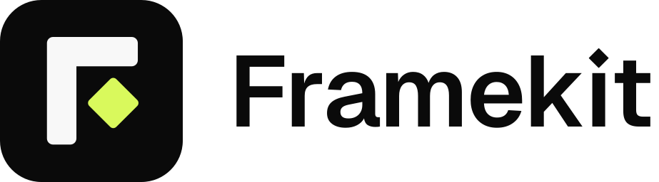
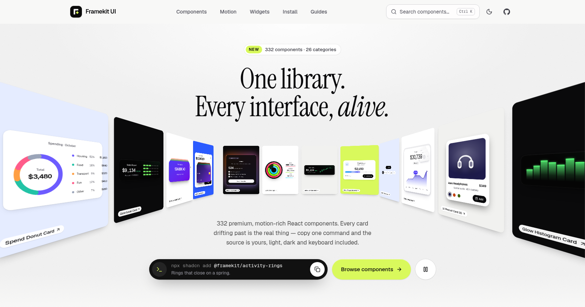
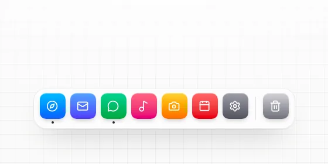
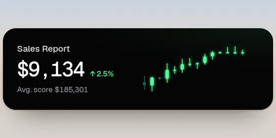
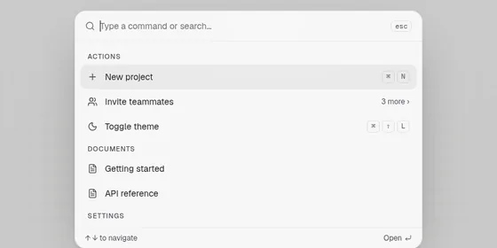
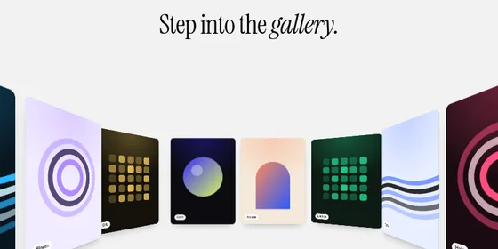

<div align="center">

<a href="https://www.framekitui.live">
  <picture>
    <source media="(prefers-color-scheme: dark)" srcset=".github/assets/logo-dark.svg">
    
  </picture>
</a>

<h3>One library. Every interface, alive.</h3>

<p>332 animated React components you install with one shadcn command and then own.<br>Built with React 19, Tailwind CSS v4 and Motion. Free and MIT licensed.</p>

<p>
  <a href="https://github.com/Sid9022/framekit-ui"></a>
  <a href="LICENSE"></a>
  <a href="https://www.framekitui.live"></a>
  <a href="https://www.framekitui.live/docs/installation"></a>
</p>

<p>
  <a href="https://www.framekitui.live"><b>Website</b></a> ·
  <a href="https://www.framekitui.live/docs/installation"><b>Docs</b></a> ·
  <a href="https://www.framekitui.live/guides"><b>Guides</b></a> ·
  <a href="https://www.framekitui.live/docs/introduction"><b>Components</b></a>
</p>

<br>

<a href="https://www.framekitui.live">
  <picture>
    <source media="(prefers-color-scheme: dark)" srcset=".github/assets/hero-dark.png">
    
  </picture>
</a>

</div>

## A few favourites

<table>
  <tr>
    <td width="50%" align="center">
      <a href="https://www.framekitui.live/docs/glass-app-dock"></a>
      <br><a href="https://www.framekitui.live/docs/glass-app-dock"><b>Glass App Dock</b></a>
      <br><sub>macOS-style magnification on a spring. Works with the keyboard too.</sub>
    </td>
    <td width="50%" align="center">
      <a href="https://www.framekitui.live/docs/glow-candle-card"></a>
      <br><a href="https://www.framekitui.live/docs/glow-candle-card"><b>Glow Candle Card</b></a>
      <br><sub>Live candlesticks, rolling numerals and a crosshair you can drive with ← →.</sub>
    </td>
  </tr>
  <tr>
    <td width="50%" align="center">
      <a href="https://www.framekitui.live/docs/spotlight-command-palette"></a>
      <br><a href="https://www.framekitui.live/docs/spotlight-command-palette"><b>Spotlight Command Palette</b></a>
      <br><sub>A ⌘K launcher with fuzzy search, nested pages and proper combobox semantics.</sub>
    </td>
    <td width="50%" align="center">
      <a href="https://www.framekitui.live/docs/perspective-tunnel-carousel"></a>
      <br><a href="https://www.framekitui.live/docs/perspective-tunnel-carousel"><b>Perspective Tunnel Carousel</b></a>
      <br><sub>Cards ride a real CSS 3D corridor. Hover to pause, drag to scrub.</sub>
    </td>
  </tr>
</table>

## Quick start

Framekit is a [shadcn registry](https://ui.shadcn.com/docs/registry). Pick a component and add it:

```bash
npx shadcn@latest add https://www.framekitui.live/r/glass-app-dock.json
```

The CLI copies the source into `components/ui/`, adds the small helpers it needs (`lib/cn.ts`, `lib/use-reduced-motion.ts`), installs `motion` and `lucide-react`, and merges the theme tokens into your CSS. From then on it's your code.

```tsx
import { GlassAppDock } from '@/components/ui/glass-app-dock'

export default function Page() {
  return <GlassAppDock onLaunch={(id) => console.log('open', id)} />
}
```

Prefer installing by name? Register the namespace once in `components.json`:

```json
{
  "registries": {
    "@framekit": "https://www.framekitui.live/r/{name}.json"
  }
}
```

```bash
npx shadcn@latest add @framekit/glass-app-dock @framekit/glow-candle-card
```

**Requirements:** React 19 and Tailwind CSS v4 (Vite, Next.js, React Router and so on), with a `components.json` and an `@/*` path alias. No `components.json` yet? Run `npx shadcn@latest init` first. The [installation docs](https://www.framekitui.live/docs/installation) cover dark mode setup and copying files by hand.

## What's inside

332 components across 26 categories. Every component page has a live preview, the source, props and its install command.

| Category | Count | Category | Count | Category | Count |
| :-- | --: | :-- | --: | :-- | --: |
| [Hero](https://www.framekitui.live/docs/category/hero) | 9 | [Cards](https://www.framekitui.live/docs/category/cards) | 27 | [Cursors](https://www.framekitui.live/docs/category/cursors) | 8 |
| [Portfolio](https://www.framekitui.live/docs/category/portfolio) | 35 | [Navigation](https://www.framekitui.live/docs/category/navigation) | 12 | [Search / Inputs](https://www.framekitui.live/docs/category/search-inputs) | 3 |
| [Animated Backgrounds](https://www.framekitui.live/docs/category/animated-backgrounds) | 15 | [Sidebars](https://www.framekitui.live/docs/category/sidebars) | 9 | [Inputs / Forms](https://www.framekitui.live/docs/category/inputs-forms) | 3 |
| [Buttons](https://www.framekitui.live/docs/category/buttons) | 24 | [WhatsApp / Messaging](https://www.framekitui.live/docs/category/whatsapp-messaging) | 14 | [Product UI](https://www.framekitui.live/docs/category/product-ui) | 14 |
| [Toggles](https://www.framekitui.live/docs/category/toggles) | 15 | [Notifications](https://www.framekitui.live/docs/category/notifications) | 6 | [Website Sections](https://www.framekitui.live/docs/category/website-sections) | 14 |
| [Text Animations](https://www.framekitui.live/docs/category/text-animations) | 15 | [Widgets](https://www.framekitui.live/docs/category/widgets) | 15 | [Motion Showcase](https://www.framekitui.live/docs/category/motion-showcase) | 15 |
| [Shimmer](https://www.framekitui.live/docs/category/shimmer) | 7 | [Voice Agent](https://www.framekitui.live/docs/category/voice-agent) | 15 | [Data Widgets](https://www.framekitui.live/docs/category/data-widgets) | 13 |
| [Loading](https://www.framekitui.live/docs/category/loading) | 11 | [Toast](https://www.framekitui.live/docs/category/toast) | 4 | [Core](https://www.framekitui.live/docs/category/core) | 18 |
| [404 Animation](https://www.framekitui.live/docs/category/404-animation) | 7 | [Vertical Scroll](https://www.framekitui.live/docs/category/vertical-scroll) | 4 | | |

## Why Framekit

- **Motion that feels physical.** Springs, inertia and easing are tuned per component, so things settle the way real objects do instead of sliding on a timer.
- **Light and dark, both designed.** Every component is checked on light and dark pages. Neither one is an afterthought.
- **Accessible by default.** Reduced motion is respected everywhere, and anything you can do with a pointer you can also do with the keyboard.
- **One command, your code, free.** Install through the shadcn CLI, edit the file however you like, and ship it. MIT licensed, so commercial projects are fine too.

## Contributing

New components and fixes are welcome. Start with [GUIDE.md](GUIDE.md), which walks through setup, the component template, wiring and a test install. If you work with an AI coding agent, point it at [AGENTS.md](AGENTS.md). The quality bar lives in [docs/COMPONENT_STANDARDS.md](docs/COMPONENT_STANDARDS.md).

To run the site locally:

```bash
npm install
npm run dev    # http://localhost:5173
```

## Credits

Built by **Siddhant Pal** · [LinkedIn](https://www.linkedin.com/in/siddhantpal9082) · [X](https://x.com/siddhantpal9022)

Thanks to everyone who has contributed:

<a href="https://github.com/Sid9022/framekit-ui/graphs/contributors">
  
</a>

## Star history

If Framekit saves you time, a star helps others find it.

<a href="https://star-history.com/#Sid9022/framekit-ui&Date">
  <picture>
    <source media="(prefers-color-scheme: dark)" srcset="https://api.star-history.com/svg?repos=Sid9022/framekit-ui&type=Date&theme=dark">
    
  </picture>
</a>

## License

[MIT](LICENSE) © Framekit UI contributors
